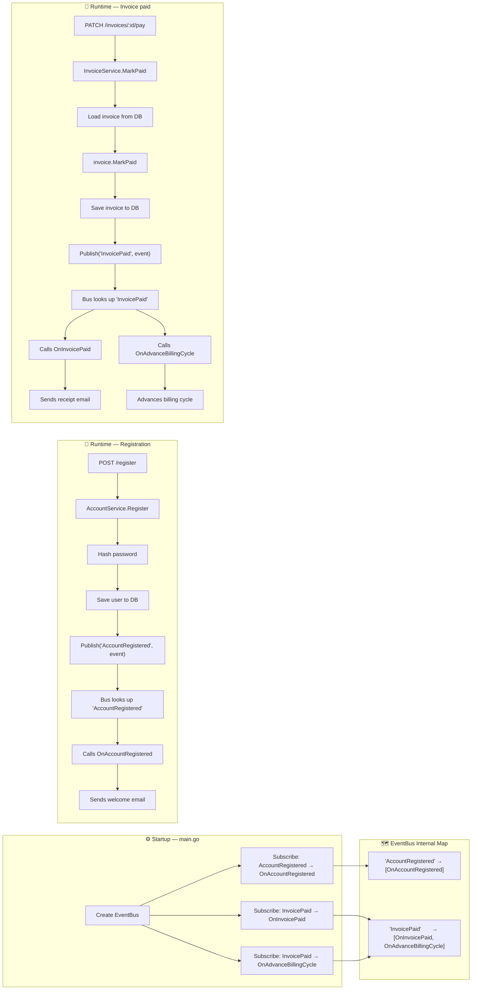

# Domain-Driven Design

---

## Introduction

Domain-driven design in this codebase is primarily about clarity and
maintainability — giving each concept a well-defined home, and keeping
business logic out of infrastructure code. The goal is not strict DDD
orthodoxy, but a pragmatic structure that scales cleanly as the
billing service grows.

---

## Bounded Contexts

Each domain is an isolated Go package under `internal/`. Packages
do not import each other except through shared primitives in `pkg/`.

| Context        | Responsibility                                      |
| -------------- | --------------------------------------------------- |
| `accounts`     | User registration, authentication, identity         |
| `plans`        | Subscription plan definitions and lifecycle         |
| `subscription` | Active subscriptions, billing cycles, status        |
| `invoice`      | Invoice creation, status transitions, payment       |
| `payment`      | Payment method storage (Stripe token references)    |
| `money`        | Shared value object — amount + ISO 4217 currency    |

---

## Layered Architecture

Every domain follows a three-layer stack. The dependency direction
is strictly top-down — providers depend on services, services depend
on repositories, repositories depend on the DB.

```
┌─────────────────────────────────────────┐
│  Provider  (HTTP transport layer)        │
│  - Parses requests, validates HTTP input │
│  - Calls service methods                 │
│  - Maps errors to status codes           │
└──────────────────┬──────────────────────┘
                   │
┌──────────────────▼──────────────────────┐
│  Service  (Application logic layer)      │
│  - Enforces business rules               │
│  - Coordinates repository calls          │
│  - Returns domain errors                 │
└──────────────────┬──────────────────────┘
                   │
┌──────────────────▼──────────────────────┐
│  Repository  (Persistence layer)         │
│  - Interface-driven                      │
│  - Single responsibility: DB access      │
│  - Returns raw domain models             │
└─────────────────────────────────────────┘
```

---

## Patterns in Use

### Repository Pattern

Each domain defines a `Repository` interface and a private
`repositoryImpl`. The service layer depends only on the interface,
keeping persistence details out of business logic and making the
domain testable in isolation.

### Read Model Separation

Write models (`UserAccounts`, `Invoice`, `Subscriptions`) carry all
fields including sensitive or internal ones. Read models
(`UserAccountsReadModel`, `InvoiceReadModel`, `SubscriptionsReadModel`)
are flattened projections — built with JOINs — safe to return directly
from API responses. This is a lightweight CQRS pattern.

### Entity Behaviour

Domain state transitions live as methods on the model, not in
handlers or services. State is never mutated externally.

```
Invoice     → MarkPaid(money), Void()
Plans       → Deprecate(), CanBeDeprecated()
Subscriptions → Activate(), Cancel(), EnterGracePeriod()
```

### Value Objects

`money.Money` is a value object with built-in validation. It
carries amount (cents) and an ISO 4217 currency code. It is
embedded directly into models via GORM's `embedded` tag.

Typed enums (`BillingInterval`, `PlanStatus`, `Status`) each
implement a `.Valid()` method, making invalid values detectable
at the domain boundary before any DB call is made.

### Service Layer

Business logic that involves coordination — validation, entity
construction, multi-step operations — lives in a `*Service`
struct per domain. Providers instantiate the service and delegate
to it; they do not contain logic themselves.

---

## Phase 1 — Service Layers (Complete)

The following domains have a full three-layer stack:

| Domain         | Provider | Service | Repository |
| -------------- | :------: | :-----: | :--------: |
| `accounts`     | ✅        | ✅       | ✅          |
| `plans`        | ✅        | ✅       | ✅          |
| `subscription` | ✅        | ✅       | ✅          |
| `invoice`      | ✅        | ✅       | ✅          |
| `payment`      | ✅        | ✅       | ✅          |

---

## Phase 2 — Event-Driven Architecture (Stripe)

When Stripe integration is added, domain events will be introduced
to decouple side effects (emails, billing cycle advancement) from
core business operations. This requires three additions:

1. `pkg/events` — an `EventBus` with `Subscribe` and `Publish`
2. Domain event structs — `AccountRegistered`, `InvoicePaid`
3. Event handlers — functions that react to published events

### EventBus Flow



### Planned Domain Events

| Event                | Published by            | Payload                        |
| -------------------- | ----------------------- | ------------------------------ |
| `AccountRegistered`  | `AccountService`        | `userID`, `email`              |
| `InvoicePaid`        | `InvoiceService`        | `invoiceID`, `userID`, `amount`|

### Planned Event Handlers

| Handler                  | Trigger          | Action                       |
| ------------------------ | ---------------- | ---------------------------- |
| `OnAccountRegistered`    | AccountRegistered | Send welcome email          |
| `OnInvoicePaid`          | InvoicePaid      | Send receipt email           |
| `OnAdvanceBillingCycle`  | InvoicePaid      | Advance subscription period  |
