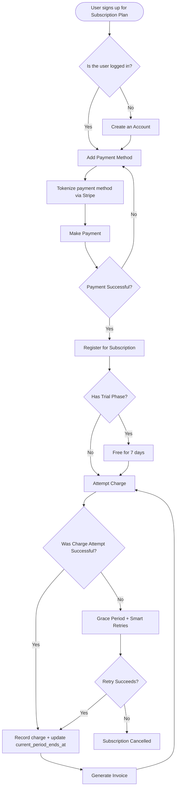

# Subscription Billing Service

A RESTful backend service built with Go and Gin for managing subscription-based billing. The service handles user accounts, subscription plans, payment methods, and billing histories — covering the full lifecycle from registration through recurring charges.

## Tech Stack

- **Go** — Gin (HTTP), GORM (ORM)
- **PostgreSQL** — primary database
- **golang-migrate** — schema migrations
- **Argon2id** — password hashing
- **JWT** — authentication (HS256, 1hr expiry)
- **Swagger/swaggo** — API documentation

## Getting Started

```bash
# Copy environment variables
cp .env.example .env

# Run database migrations
make migrate-up

# Seed development data
make seed

# Start the server
make run
```

Swagger UI is available at `http://localhost:8080/swagger/index.html`.

## General Flow


