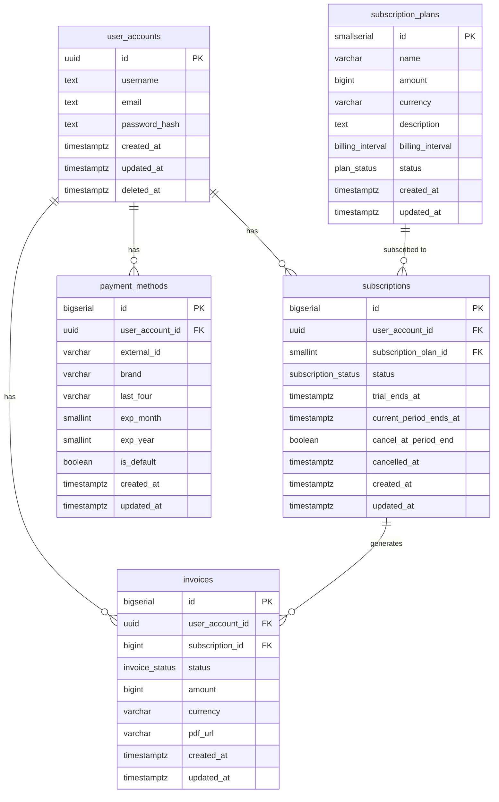

# Subscription Billing Service

A RESTful backend service built with Go and Gin for managing subscription-based billing. The service handles user accounts, subscription plans, payment methods, and billing histories — covering the full lifecycle from registration through recurring charges.

## Tech Stack

- **Go** — Gin (HTTP), GORM (ORM)
- **PostgreSQL** — primary database
- **golang-migrate** — schema migrations
- **Argon2id** — password hashing
- **JWT** — authentication (HS256, 1hr expiry)
- **Swagger/swaggo** — API documentation
- **Docker + Docker Compose** — containerised local environment

## Getting Started

### Local (without Docker)

```bash
# Copy and fill in environment variables
cp .env.example .env

# Run database migrations
make migrate-up

# Seed development data
make seed

# Start the server
make run
```

Swagger UI is available at `http://localhost:8080/swagger/index.html`.

### Docker

**Prerequisites:** Docker and Docker Compose installed and running.

```bash
# Copy and fill in environment variables
cp .env.example .env
```

| Command | Description |
|---|---|
| `make deploy` | Build images, run migrations, start all services |
| `make deploy-seeded` | Same as above, then seeds the database with development data |
| `make down` | Stop and remove all containers (data volume is preserved) |
| `docker compose down -v` | Stop containers and wipe the database volume |

Once running, services are available at:

| Service | URL |
|---|---|
| API | `http://localhost:8080` |
| Swagger UI | `http://localhost:8080/swagger/index.html` |
| Frontend | `http://localhost:80` |

### Docker Services

The Compose environment runs four services:

- **db** — PostgreSQL 16. Initialised from `DB_USER`, `DB_PASSWORD`, `DB_NAME` in `.env`. Data is persisted in a named Docker volume.
- **migrate** — Runs all pending migrations from `backend/migrations/` on startup, then exits.
- **backend** — The compiled Go API server.
- **frontend** — nginx serving the static HTML frontend.

## Database Schema



## General Flow


